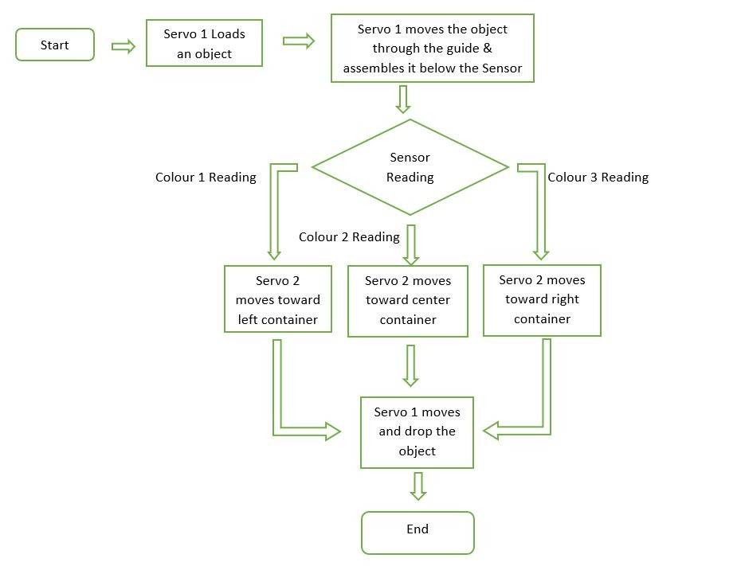
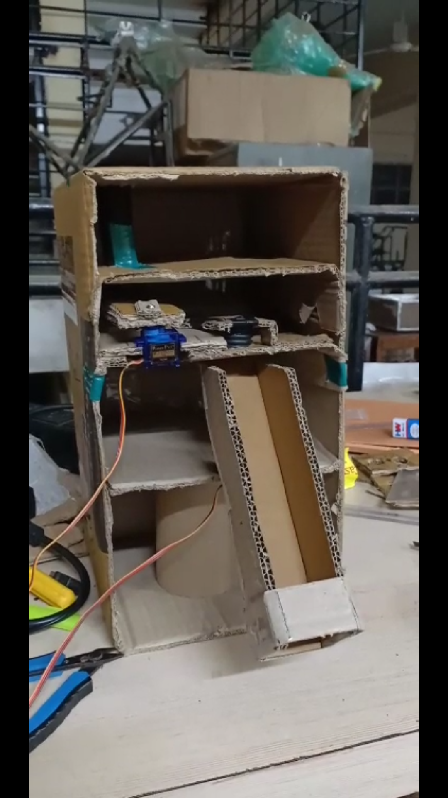
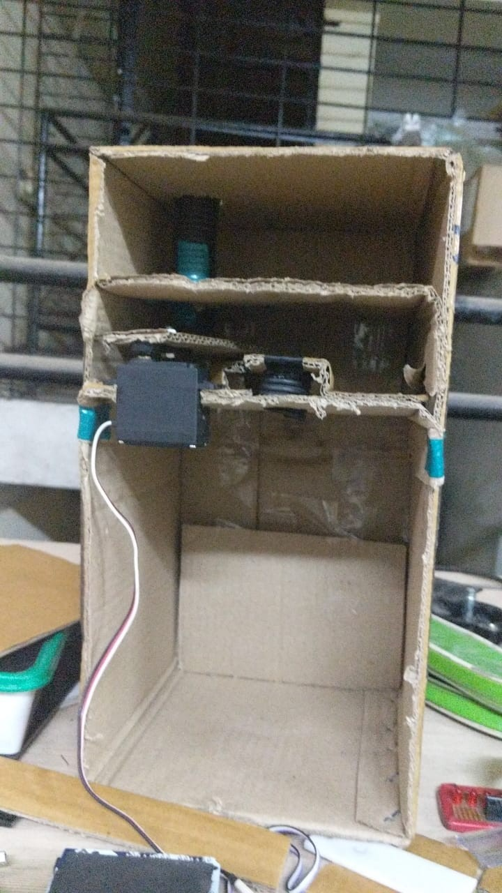
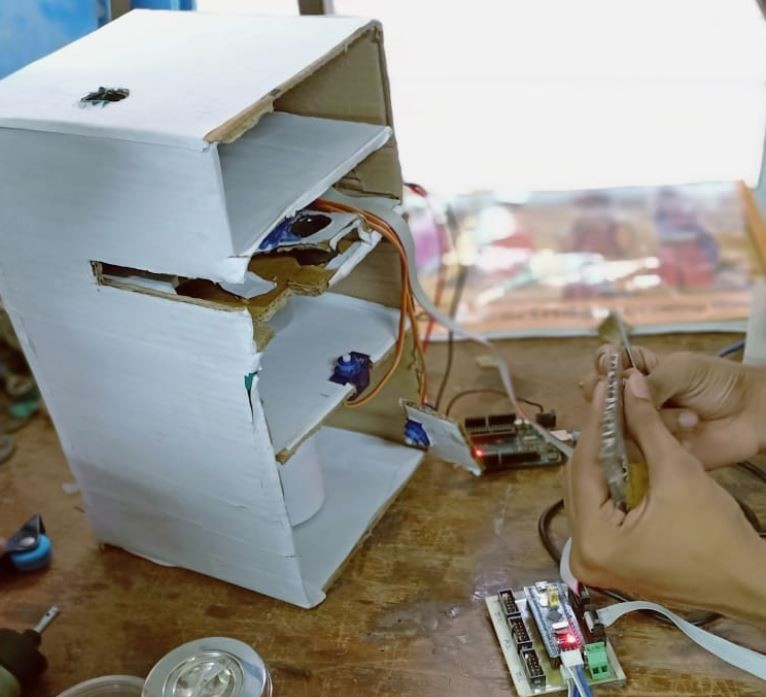
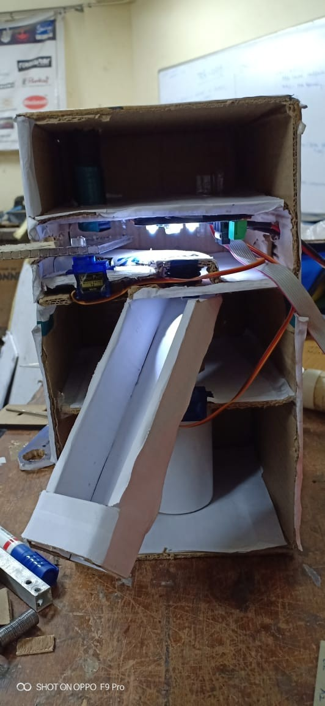

# Prototype-color-sorter-machine
This project presents a working prototype for automatically sorting objects based on their color. It uses an **OPT101** sensor for color detection and an **STM32F103** microcontroller for system control. Color detection is based on ADC values from the sensor output. Two servo motors handle the movement: one positions the object under the sensor, and the other sorts it into designated bins.

## Components

- **[STM32F103x](#)** – Microcontroller unit  
- **[Servo Motors](#)** – Two servo motors for object handling  
- **Color Sensor** – OPT101 photodiode IC with piranha LEDs [(More Info)](#)

## Flow Chart

## Design and Construction

<table>
  <tr>
    <td align="center">
       
      <b>Figure 1:</b> Testing of lower servo
    </td>
    <td align="center">
       
      <b>Figure 2:</b> Testing of upper servo
    </td>
  </tr>
  <tr>
    <td align="center">
       
      <b>Figure 3:</b> Assembling of guide, sensor, and microcontroller
    </td>
    <td align="center">
       
      <b>Figure 4:</b> Final design of the prototype
    </td>
  </tr>
</table>

## Documentation

Full report: [`docs/report.pdf`](docs/Color%20Sorter%20Final%20report%20.pdf)

---

© 2025 Prototype Color Sorter Team. All rights reserved.
